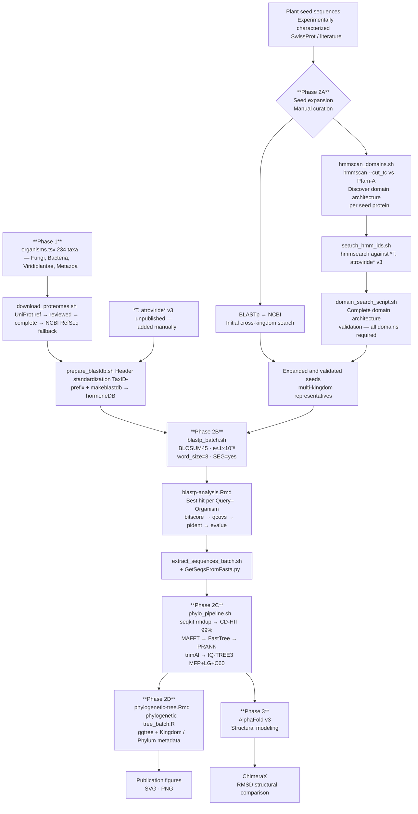

# Phytohormones in Fungi: Inter-Kingdom Modulators or Fungal Self-Controlling Elements?

[](https://opensource.org/licenses/MIT)
[](https://doi.org/10.5281/zenodo.20115766)
[](https://github.com/DavidAlberto/Phytohormones-Fungi)
[](https://github.com/DavidAlberto/Phytohormones-Fungi)

This repository contains the complete, reproducible bioinformatics pipeline used in the study of phytohormone-associated gene homologs across the fungal tree of life. The workflow integrates a taxonomically curated custom protein database, cross-kingdom homology detection with domain architecture validation, phylogeny-aware sequence alignment, and maximum-likelihood phylogenetic inference.

> **Associated publication:**
> García-Estrada, D.A., et al. (2026). *When Fungi Speak the Language of Plants: Shared Phytohormones with Divergent Meanings*. ASM Microbiology Society. (Manuscript submitted)

---

## Table of Contents

- [Overview](#overview)
- [Repository structure](#repository-structure)
- [Installation](#installation)
- [Pipeline](#pipeline)
  - [Phase 1 — Custom database construction](#phase-1--custom-database-construction)
  - [Phase 2A — Seed expansion](#phase-2a--seed-expansion-cross-kingdom-search)
  - [Phase 2B — BLASTp against the custom database](#phase-2b--blastp-against-the-custom-database)
  - [Phase 2C — Phylogenetic inference](#phase-2c--phylogenetic-inference)
  - [Phase 2D — Tree visualization](#phase-2d--tree-visualization)
  - [Phase 3 — Structural comparison](#phase-3--structural-comparison)
- [Data requirements](#data-requirements)
- [Software requirements](#software-requirements)
- [Reproducibility](#reproducibility)
- [Citation](#citation)
- [License](#license)
- [Contact](#contact)

---

## Overview

The pipeline is divided into two sequential phases. **Phase 1** constructs a non-redundant protein database from 234 organisms spanning the full fungal tree of life and key outgroups (Viridiplantae, Metazoa, Bacteria, Archaea). **Phase 2** performs homology detection, curation, and phylogenetic inference using that database.

The *Trichoderma atroviride* v3 proteome (the primary study organism, currently unpublished) was incorporated manually into the database and is not downloaded by the automated scripts.



**Phase 2A** uses two independent methods (BLASTp and profile HMM search) to find cross-kingdom homologs of plant seed sequences. A candidate was accepted only if it possessed the **complete domain architecture** of the reference protein — sequences missing any expected domain were excluded. Candidate selection in this phase was performed manually by the authors.

**Phase 2B–D** applies the expanded, validated seed set against the custom database, curates one representative sequence per organism per gene family, and infers maximum-likelihood phylogenies with statistical support.

---

## Repository structure

```
Phytohormones-Fungi/
│
├── README.md                        # This file
├── LICENSE                          # MIT License
├── CITATION.cff                     # Citation metadata
├── env/
│   ├──environment.yml               # Conda environment
│   └──environment.lock.linux-64.yml # Exact locked environment used in the study
├── scripts/                         # All pipeline scripts
│   ├── README.md                    # Script-level documentation (inputs, outputs, rationale)
│   │
│   ├── # Phase 1 — Database construction
│   ├── 01-download_proteomes.sh
│   ├── 02-prepare_blastdb.sh
│   │
│   ├── # Phase 2A — Seed expansion (HMM-based)
│   ├── 03-hmmscan_domains.sh
│   ├── 04-extract_hmm_ids.sh
│   ├── 05-generate_hmm_consensus.sh
│   ├── 06-search_hmm_ids.sh
│   ├── 07-domain_search_script.sh
│   │
│   ├── # Phase 2B — BLASTp and curation
│   ├── 08-blastp_batch.sh
│   ├── 09-blastp-analysis.Rmd
│   ├── 10-extract_sequences_batch.sh
│   ├── GetSeqsFromFasta.py
│   │
│   ├── # Phase 2C–D — Phylogenetics and visualization
│   ├── 11-phylo_pipeline.sh
│   ├── 12-phylogenetic-tree.Rmd
│   └── 12-phylogenetic-tree_batch.R
│
├── data/
│   ├── organisms.tsv                # List of organisms used to build the DB
│   └── metadata.tsv                 # Organism, TaxIDs, Kingdom, Phylum, Early, etc.
│
└── docker/
    └── Dockerfile                   # Container with all command-line dependencies
```

> **Note on large files:** Protein databases (`hormoneDB.fasta`, proteome FASTA files) and analysis outputs (alignments, tree files) are not tracked in Git due to size.

---

## Installation

### Option 1 — Conda (recommended)

Two environment files are provided to balance reproducibility and portability.

**Cross-platform (recommended for new users):**
```bash
git clone https://github.com/DavidAlberto/Phytohormones-Fungi.git
cd Phytohormones-Fungi

conda env create -f env/environment.yml
conda activate hormone-phylo
```

**Exact environment used in the study (Linux x86-64 only):**
```bash
conda create --name hormone-phylo --file env/environment.lock.linux-64.yml
conda activate hormone-phylo
```

**Verify key tools:**
```bash
blastp -version
mafft --version
iqtree3 --version
trimal --version
hmmscan -h
```

**R packages**
```r
install.packages(c("tidyverse", "svglite", "here", "ape", "phangorn", "gridExtra"))

if (!requireNamespace("BiocManager", quietly = TRUE))
    install.packages("BiocManager")
BiocManager::install(c("ggtree", "treeio"))
```

### Option 2 — Docker

```bash
docker pull davidalbertoge/hormone-analysis:latest
docker run -v $(pwd):/home/ -it davidalbertoge/hormone-analysis:latest
```

> The Docker image covers all command-line tools. R and R packages require separate installation or the Conda environment above.

### Conda path configuration

`phylo_pipeline.sh` initializes Conda from the path specified in the `CONDA_BASE` variable at the top of the script. The default is `~/miniconda3`. If your installation is elsewhere (e.g., `~/anaconda3`, `/opt/conda`), edit that variable before running:

```bash
# At the top of phylo_pipeline.sh — USER CONFIGURATION section
readonly CONDA_BASE="$HOME/miniconda3"   # adjust as needed
```

---

## Pipeline

### Phase 1 — Custom database construction

**1.1 Download proteomes**

Edit `data/organisms.tsv` to define the target organisms (one scientific name per line), then run:

```bash
bash scripts/01-download_proteomes.sh
```

Downloads one proteome per organism using a hierarchical fallback strategy (UniProt reference → reviewed → complete → NCBI RefSeq). Outputs are written to `proteomes/` and download manifests to `manifests/`.

> **Important:** The *T. atroviride* v3 proteome must be added manually to `proteomes/` before the next step, named as `<TaxID>.fasta` following the same convention.

**1.2 Build the BLAST database**

```bash
bash scripts/02-prepare_blastdb.sh

# Then index for BLASTp:
makeblastdb -in data/hormoneDB.fasta -dbtype prot -parse_seqids \
            -out data/blastDB
```

Standardizes all FASTA headers to `>TaxID|original_header` format and merges all proteomes into `hormoneDB.fasta`.

---

### Phase 2A — Seed expansion (cross-kingdom search)

This phase expands and validates the initial plant seed sequences using two independent methods before the main database search. Candidate selection was performed **manually** by the authors.

**2A.0 Make HMMER database**

```bash
wget https://ftp.ebi.ac.uk/pub/databases/Pfam/current_release/Pfam-A.hmm.gz
mv Pfam-A.hmm.gz data/hmmerDB/.
gunzip data/hmmerDB/Pfam-A.hmm.gz
hmmpress data/hmmerDB/Pfam-A.hmm
```

**2A.1 Discover domain architecture of seed proteins**

```bash
bash scripts/03-hmmscan_domains.sh data/hmmerDB/Pfam-A.hmm \
      input/hmmer/seed_proteins.fasta results/hmmer/hmmscan_domains
```

**2A.2 Fetch Pfam HMM profiles**

```bash
bash scripts/04-extract_hmm_ids.sh data/hmmerDB/Pfam-A.hmm \
      input/hmmer/pfam_ids.txt results/hmmer/hmm_profiles/
```

**2A.3 Generate consensus sequences (optional)**

```bash
bash scripts/05-generate_hmm_consensus.sh \
      results/hmmer/hmm_profiles/ results/hmmer/hmm_consensus/
```

**2A.4 Search HMMs against *T. atroviride* v3**

```bash
bash scripts/06-search_hmm_ids.sh results/hmmer/hmm_profiles/ \
      data/proteomes/<TaxID_Tatroviride>.fasta results/hmmer/hmm_search/
```

**2A.5 Validate complete domain architecture**

```bash
bash scripts/07-domain_search_script.sh <PFAM_ID> input/hmmer/candidate_sequences.fasta \
      results/hmmer/hmm_domains/<PFAM_ID>
```

Candidates passing both BLASTp similarity criteria and complete domain validation were used as expanded seeds in **Phase 2B**.

---

### Phase 2B — BLASTp against the custom database

**2B.1 Run BLASTp in batch**

Place expanded seed FASTA files in `input/hormone/` (one file per gene family), then:

```bash
bash scripts/08-blastp_batch.sh
```

> **Parameters:** BLOSUM45 matrix, e-value ≤ 1×10⁻⁵, word size 3, SEG filter enabled, post-search filters ≥30% identity and ≥50% query coverage.

**2B.2 Curate best hits per organism**

Open and knit `scripts/09-blastp-analysis.Rmd` in RStudio, or render from the command line:

Selects one best hit per Query–Organism pair (priority: bit score → query coverage → percent identity → e-value). Outputs a consolidated TSV and individual TSVs per gene family.

**2B.3 Extract sequences**

```bash
bash scripts/10-extract_sequences_batch.sh
```

Retrieves FASTA sequences from `hormoneDB.fasta` using the curated subject IDs.

---

### Phase 2C — Phylogenetic inference

Place the sequences from Phase 2B into `01_sequences/` (one FASTA per gene family), then:

```bash
bash scripts/11-phylo_pipeline.sh
```

The pipeline runs the following steps with checkpoints (completed steps are skipped on re-run):

| Step | Tool | Purpose |
|---|---|---|
| Header rename | `awk` | Standardize to `Genus_Species_TaxID_UniprotID_GeneName` |
| Deduplication | `seqkit rmdup` | Remove exact sequence duplicates |
| Clustering | `cd-hit -c 0.99` | Remove sequences ≥99% identical |
| Alignment | `mafft --auto --reorder` | Multiple sequence alignment |
| Guide tree | `FastTree -lg -gamma` | Approximate ML tree for PRANK |
| Alignment refinement | `prank -protein -iterate=3` | Phylogeny-aware alignment |
| Trimming | `trimal -automated1` | Remove poorly aligned columns |
| Phylogenetic inference | `iqtree3 MFP + LG+C60` | ML tree with bootstrap support |

Outputs are written to numbered directories (`02_filtering/` through `07_iqtree/`).

> **IQ-TREE model note:** `MFP` (ModelFinder Plus) explores standard substitution models. `-madd LG+C60,LG+F+C60` additionally tests profile mixture models, which better capture compositional heterogeneity across distantly related taxa spanning multiple kingdoms.

> **Computational note:** The `LG+C60` models are substantially slower than standard models. Running on a dataset of ~150 sequences per gene family, IQ-TREE may require 1–12 hours per gene family depending on available CPU cores. Use `-T AUTO` (already set) to utilize all available threads.

---

### Phase 2D — Tree visualization

**Single tree (interactive):**

Open `scripts/12-phylogenetic-tree.Rmd` in RStudio, set the path to your `.treefile` and metadata file in the configuration section, then knit.

**Batch processing (all gene families):**

```bash
Rscript scripts/12-phylogenetic-tree_batch.R
```

Generates cladogram and phylogram figures (SVG + PNG) for all trees in the IQ-TREE output directory. Tip labels are colored by Kingdom and shaped by Phylum using the taxonomy metadata file.

---

### Phase 3 — Structural comparison

Representative sequences from major phylogenetic clades were modeled with **AlphaFold v2** and structural comparisons were performed in **ChimeraX** using RMSD as the similarity metric. This phase was conducted manually and is not automated by a script.

- AlphaFold web server: <https://alphafold.ebi.ac.uk/>
- ChimeraX download: <https://www.cgl.ucsf.edu/chimerax/>

---

## Data requirements

### organisms.tsv

Defines the 234 organisms used to build the custom database. Covers:

- **Fungi:** Ascomycota, Basidiomycota, Chytridiomycota, Mucoromycota, Zoopagomycota, Blastocladiomycota, Microsporidia, and early-diverging lineages
- **Outgroups:** Viridiplantae (embryophytes and algae), Metazoa (vertebrates and invertebrates), Bacteria (Proteobacteria, Cyanobacteria, Firmicutes, Actinobacteria, Thermotogae), Archaea, and unicellular eukaryotes

The taxonomic breadth was deliberately designed to place fungal genes in a broad evolutionary context and assess phytohormone-associated gene distribution across the tree of life.

### taxonomy_metadata.tsv

Required by the visualization scripts. Tab-separated with the following columns:

| Column | Description | Example |
|---|---|---|
| TaxID | NCBI Taxonomy ID | 5476 |
| Organism | Scientific name | *Candida albicans* |
| Kingdom | Taxonomic kingdom | Fungi |
| Phylum | Taxonomic phylum | Ascomycota |
| EarlyDivergent | Basal lineage flag | TRUE / FALSE |

### Note on *T. atroviride* v3

This proteome is currently unpublished and not available in public databases. It was incorporated manually into the custom database. Researchers wishing to reproduce the exact analysis may request it from the corresponding author.

---

## Software requirements

### Command-line tools

| Tool | Version tested | Purpose |
|---|---|---|
| BLAST+ | 2.17.0 | Homology searches |
| MAFFT | 7.526 | Multiple sequence alignment |
| FastTree | 2.2.0 | Guide tree generation |
| PRANK | 170427 | Phylogeny-aware alignment refinement |
| trimAl | 1.5.0 | Alignment trimming |
| IQ-TREE | 3.0.1 | Phylogenetic inference |
| CD-HIT | 4.8.1 | Sequence clustering |
| SeqKit | 2.10.1 | Sequence deduplication |
| HMMER | 3.4 | Profile HMM searches |
| NCBI E-Direct | 24.0 | Proteome download from NCBI |
| Python | 3.12 | Sequence extraction helper |
| BioPython | 1.86 | FASTA parsing |

All versions are pinned in `env/environment.lock.linux-64.yml` and available via Conda.

### R packages

| Package | Source | Purpose |
|---|---|---|
| tidyverse | CRAN | Data wrangling and plotting |
| ggplot2 | CRAN | Graphics |
| gridExtra | CRAN | Multi-panel figures |
| svglite | CRAN | SVG export |
| here | CRAN | Project-relative paths |
| ape | CRAN | Phylogenetic data structures |
| phangorn | CRAN | Phylogenetic analysis |
| ggtree | Bioconductor | Phylogenetic tree visualization |
| treeio | Bioconductor | Tree I/O (IQ-TREE format support) |
| rmarkdown | CRAN | Reproducible report generation |

---

## Reproducibility

- **Locked environment:** `env/environment.lock.linux-64.yml` pins the exact build string of every dependency used in the published analysis (Linux x86-64).
- **Docker image:** `davidalbertoge/hormone-analysis:latest` provides a pre-configured container with all command-line tools.
- **Checkpointed pipeline:** `phylo_pipeline.sh` skips completed steps on re-run, allowing safe interruption and resumption.
- **Zenodo archive:** A snapshot of this repository including all analysis outputs (alignments, tree files, figures) is permanently archived at [https://doi.org/10.5281/zenodo.XXXXXXX](https://doi.org/10.5281/zenodo.XXXXXXX).
- **Database versions:** Proteomes were downloaded from UniProt in [october 2025] and from NCBI RefSeq in [october 2025]. The exact download manifest is available in `manifests/proteomes.tsv` in the Zenodo archive.

---

## Citation

If you use this pipeline, please cite both the article and the software:

**Article:**
> García-Estrada, D.A., et al. (2026). When Fungi Speak the Language of Plants: Shared Phytohormones with Divergent Meanings. *ASM Microbiology Society*. (Manuscript submitted)

**Software:**
> García-Estrada, D.A. (2026). *Phytohormones-Fungi: a reproducible phylogenomic pipeline* (v1.0.0). Zenodo. https://doi.org/10.5281/zenodo.XXXXXXX

**BibTeX:**
```bibtex
@article{garcia2026fungi,
  title   = {When Fungi Speak the Language of Plants: Shared Phytohormones
             with Divergent Meanings},
  author  = {García-Estrada, David Alberto and others},
  journal = {ASM Microbiology Society},
  year    = {2026},
  note    = {Manuscript submitted}
}

@software{garcia2026pipeline,
  author    = {García-Estrada, David Alberto},
  title     = {Phytohormones-Fungi: a reproducible phylogenomic pipeline},
  year      = {2026},
  publisher = {Zenodo},
  version   = {v1.0.0},
  doi       = {10.5281/zenodo.20115766},
  url       = {https://github.com/DavidAlberto/Phytohormones-Fungi}
}
```

---

## License

This project is licensed under the MIT License. See [LICENSE](LICENSE) for details.

---

## Contact

**David Alberto García Estrada**
Researcher — Center for Research in Advanced Materials (CIMAV), Chihuahua, México

- Email: [david.garcia@cimav.edu.mx](mailto:david.garcia@cimav.edu.mx)
- ORCID: [0009-0007-1169-5329](https://orcid.org/0009-0007-1169-5329)
- ResearchGate: [David-Garcia-Estrada](https://www.researchgate.net/profile/David-Garcia-Estrada)

For technical questions, please [open an issue](https://github.com/DavidAlberto/Phytohormones-Fungi/issues) rather than emailing directly — this keeps solutions visible to other users.
